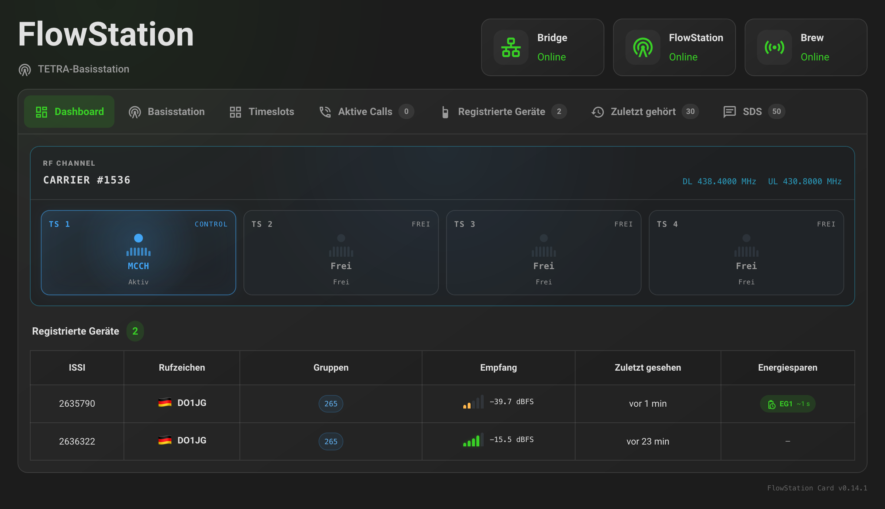
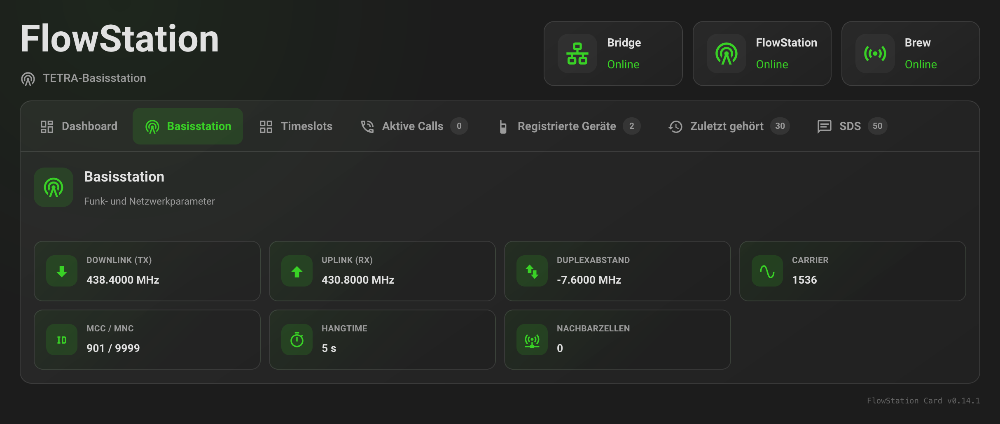
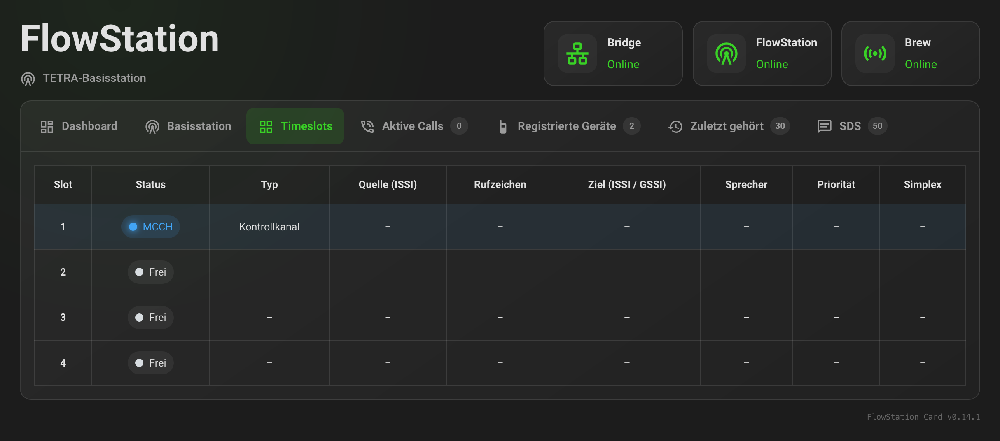
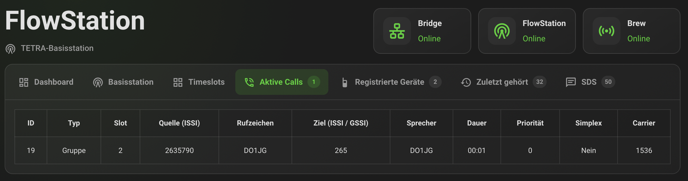
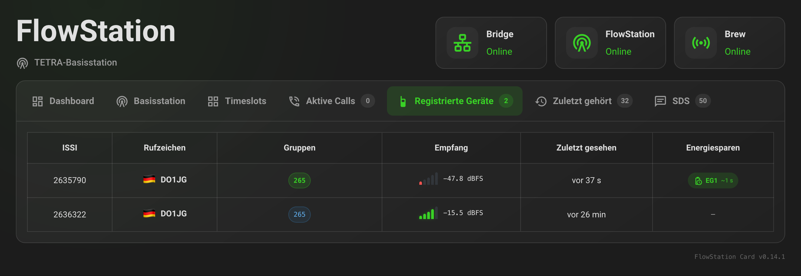
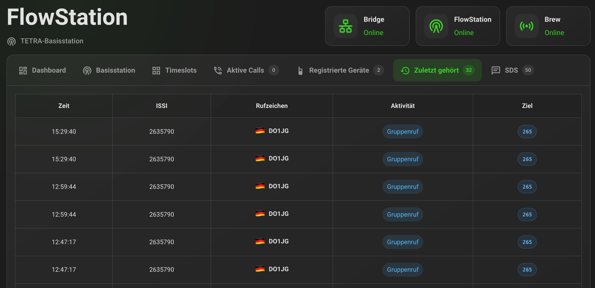
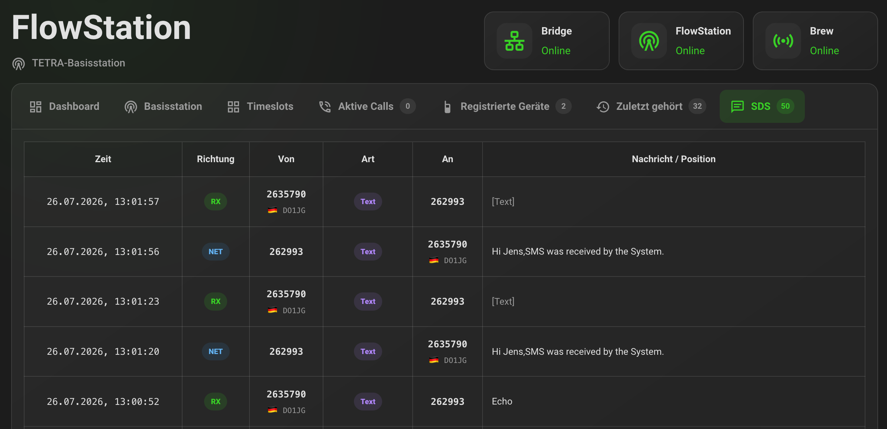
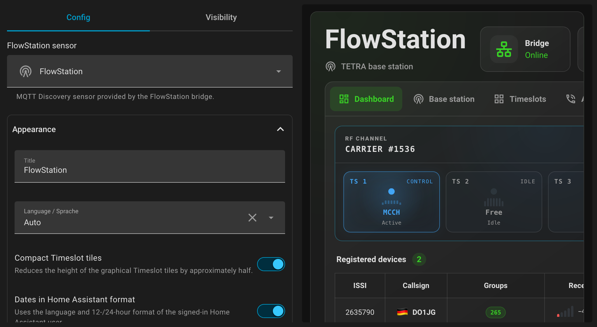

# FlowStation Card

A responsive Home Assistant custom card for monitoring a
[FlowStation](https://github.com/razvanzeces/flowstation) TETRA base station.

[](https://my.home-assistant.io/redirect/hacs_repository/?owner=Nisbo&repository=ha-flowstation&category=plugin)



## Features

- Dashboard overview with four graphical TETRA Timeslot tiles
- Bridge, FlowStation and Brew connection status
- Base-station frequencies, Carrier, MCC/MNC, Hangtime and neighbor cells
- Live active-call details, duration, source, destination and speaker
- Registered radios with callsign, country flag, affiliated groups, RSSI and
  Energy Economy Group
- Last-heard history
- SDS log with direction, source, destination, protocol type and message text
- LIP detection; coordinates are linked to a map when FlowStation provides a
  decoded position
- German and English interface with automatic Home Assistant language detection
- Visual Home Assistant card editor based on `getConfigForm`
- Configurable default tab, visible tabs, history limits, timestamp format and
  compact Timeslot tiles
- Targeted updates: unrelated Home Assistant entity changes do not rerender the
  card

## Screenshots

Click any preview to open the full-resolution image.

<table>
  <tr>
    <td width="50%">
      <strong>Base station</strong><br>
      <a href="screenshots/base-station.png">
        
      </a>
    </td>
    <td width="50%">
      <strong>Timeslots</strong><br>
      <a href="screenshots/timeslots.png">
        
      </a>
    </td>
  </tr>
  <tr>
    <td width="50%">
      <strong>Active calls</strong><br>
      <a href="screenshots/active-calls.png">
        
      </a>
    </td>
    <td width="50%">
      <strong>Registered devices</strong><br>
      <a href="screenshots/registered-devices.png">
        
      </a>
    </td>
  </tr>
  <tr>
    <td width="50%">
      <strong>Last heard</strong><br>
      <a href="screenshots/last-heard.png">
        
      </a>
    </td>
    <td width="50%">
      <strong>SDS</strong><br>
      <a href="screenshots/sds.png">
        
      </a>
    </td>
  </tr>
  <tr>
    <td colspan="2">
      <strong>Visual configuration editor</strong><br>
      <a href="screenshots/config-editor.png">
        
      </a>
    </td>
  </tr>
</table>

## Requirements

This card does not connect to FlowStation directly. It requires the companion
[flowstation-mqtt](https://github.com/Nisbo/flowstation-mqtt) bridge, which
reads the FlowStation WebSocket/API, publishes the data to MQTT and creates the
Home Assistant sensor through MQTT Discovery.

Install and configure the bridge before adding the card. Its installer checks
the FlowStation and MQTT connections and creates the required sensor
automatically. The default entity expected by the card is:

```text
sensor.flowstation_flowstation
```

The entity ID can be changed in the visual card editor or in YAML.

## Installation with HACS

### Open directly in HACS

Use the button at the top of this README, or click:

[Open FlowStation Card in HACS](https://my.home-assistant.io/redirect/hacs_repository/?owner=Nisbo&repository=ha-flowstation&category=plugin)

### Add it as a custom repository

1. Open HACS in Home Assistant.
2. Open the menu in the top-right corner and select **Custom repositories**.
3. Enter:

   ```text
   https://github.com/Nisbo/ha-flowstation
   ```

4. Select **Dashboard** as the repository type.
5. Add the repository and download **FlowStation Card**.
6. Reload the browser. If an older version remains cached, perform a hard reload.

HACS normally registers the JavaScript resource automatically.

## Manual installation

1. Copy `ha-flowstation.js` to:

   ```text
   /config/www/ha-flowstation.js
   ```

2. Open **Settings → Dashboards → Resources** in Home Assistant.
3. Add `/local/ha-flowstation.js` as a **JavaScript module**.
4. Reload the browser.

## Adding the card

Use the visual dashboard editor or add a manual card:

```yaml
type: custom:ha-flowstation-card
entity: sensor.flowstation_flowstation
title: FlowStation
```

## Configuration

| Option | Default | Description |
|---|---:|---|
| `entity` | `sensor.flowstation_flowstation` | MQTT Discovery sensor supplied by the bridge |
| `title` | `FlowStation` | Card title |
| `language` | `auto` | `auto`, `de` or `en` |
| `default_tab` | `dashboard` | Tab selected when the card is first opened |
| `compact_timeslots` | `false` | Use approximately half-height Dashboard Timeslot tiles |
| `localized_timestamps` | `true` | Format complete dates using the HA user's locale and clock preference |
| `max_last_heard` | `10` | Maximum visible Last heard rows |
| `max_sds_entries` | `20` | Maximum visible SDS rows |
| `hide_dashboard` | `false` | Hide the Dashboard tab |
| `hide_base_station` | `false` | Hide the Base station tab |
| `hide_timeslots` | `false` | Hide the Timeslots tab |
| `hide_active_calls` | `false` | Hide the Active calls tab |
| `hide_registered_devices` | `false` | Hide the Registered devices tab |
| `hide_last_heard` | `false` | Hide the Last heard tab |
| `hide_sds` | `false` | Hide the SDS tab |

Valid `default_tab` values are:

```text
dashboard
base_station
timeslots
active_calls
registered_devices
last_heard
sds
```

Complete example:

```yaml
type: custom:ha-flowstation-card
entity: sensor.flowstation_flowstation
title: FlowStation
language: auto
default_tab: dashboard
compact_timeslots: true
localized_timestamps: true
max_last_heard: 15
max_sds_entries: 25
hide_dashboard: false
hide_base_station: false
hide_timeslots: false
hide_active_calls: false
hide_registered_devices: false
hide_last_heard: false
hide_sds: false
```

## Home Assistant values

The sensor state is the current number of active calls. The bridge adds the
following attributes:

| Attribute | Description |
|---|---|
| `active_calls` | Number of active calls |
| `calls` | List containing all active call details |
| `slots` | Current data for Timeslots 1–4 |
| `registered_count` | Number of registered radios |
| `registered_devices` | Registered radios and their live metadata |
| `last_heard` | Last-heard call and SDS activity |
| `sds_count` | Number of retained SDS log entries |
| `sds_last` | Most recently received or sent SDS entry |
| `sds_log` | List of retained SDS entries |
| `bridge_online` | MQTT bridge connection status |
| `flowstation_online` | FlowStation WebSocket connection status |
| `brew_online` | Brew connection status |
| `brew_version` | Detected Brew version |
| `tx_freq_hz` | Downlink frequency in Hz |
| `rx_freq_hz` | Uplink frequency in Hz |
| `shift_hz` | Duplex spacing in Hz |
| `mcc`, `mnc` | TETRA network identifiers |
| `main_carrier` | Main Carrier number |
| `carriers` | Configured Carrier list |
| `neighbor_count` | Number of neighbor cells |
| `hangtime_secs` | Call Hangtime in seconds |
| `whitelist_restricted` | Whether registration is whitelist-restricted |
| `whitelist_count` | Number of whitelist entries |

### Active call fields

Each item in `calls` may contain:

```text
call_id, type, source, source_callsign, destination, speaker,
speaker_callsign, priority, simplex, carrier, slot, peer_carrier,
peer_slot, started_secs_ago
```

### Registered-device fields

Each item in `registered_devices` may contain:

```text
issi, callsign, country_flag, groups, selected_group, rssi_dbfs,
registered_at, last_seen_at, last_seen_secs_ago, energy_saving_mode
```

### SDS fields

`sds_last` and every item in `sds_log` may contain:

```text
time, received_at, direction, source_issi, source_callsign,
source_country_flag, dest_issi, destination_callsign,
destination_country_flag, is_group, protocol_id, text
```

`received_at` is present on live SDS events and allows automations to distinguish
a new message from later sensor updates such as callsign resolution.

## Automation examples

Replace the entity ID and notification action as needed.

### Notify when a call becomes active

```yaml
alias: FlowStation - Active call
mode: queued
trigger:
  - platform: state
    entity_id: sensor.flowstation_flowstation
    attribute: active_calls
condition:
  - condition: template
    value_template: >
      {{ trigger.to_state.attributes.active_calls | int(0) > 0 }}
action:
  - action: persistent_notification.create
    data:
      title: FlowStation
      message: >
        {{ trigger.to_state.attributes.active_calls }} active call(s)
```

### Notify for every new SDS

This uses the normal MQTT Discovery sensor; no additional MQTT subscription is
required.

```yaml
alias: FlowStation - Any new SDS
mode: queued
trigger:
  - platform: state
    entity_id: sensor.flowstation_flowstation
    attribute: sds_last
condition:
  - condition: template
    value_template: >
      
      
      {{ new.get('received_at') is not none
         and new.get('received_at') != old.get('received_at') }}
action:
  - variables:
      sds: "{{ trigger.to_state.attributes.sds_last }}"
  - action: persistent_notification.create
    data:
      title: "New FlowStation SDS"
      message: >
        From {{ sds.source_callsign or sds.source_issi }}
        to {{ sds.dest_issi }}: {{ sds.text or ('PID ' ~ sds.protocol_id) }}
```

### Monitor SDS messages from one ISSI

Replace `2635790` with the ISSI to monitor.

```yaml
alias: FlowStation - Monitored ISSI sent an SDS
mode: queued
trigger:
  - platform: state
    entity_id: sensor.flowstation_flowstation
    attribute: sds_last
condition:
  - condition: template
    value_template: >
      
      
      {{ new.get('received_at') is not none
         and new.get('received_at') != old.get('received_at')
         and new.get('source_issi') | int(0) == 2635790 }}
action:
  - variables:
      sds: "{{ trigger.to_state.attributes.sds_last }}"
  - action: persistent_notification.create
    data:
      title: "SDS from monitored ISSI"
      message: >
        {{ sds.source_callsign or sds.source_issi }}:
        {{ sds.text or ('PID ' ~ sds.protocol_id) }}
```

## LIP positions

FlowStation currently identifies binary LIP messages through protocol ID 10 but
does not expose their raw payload or decoded coordinates through its SDS
WebSocket/API data. The card therefore marks these entries as unavailable.
If a future FlowStation version provides text in the form
`LIP position: latitude, longitude`, the card automatically displays the
coordinates as a map link.

## License

MIT © Nisbo
